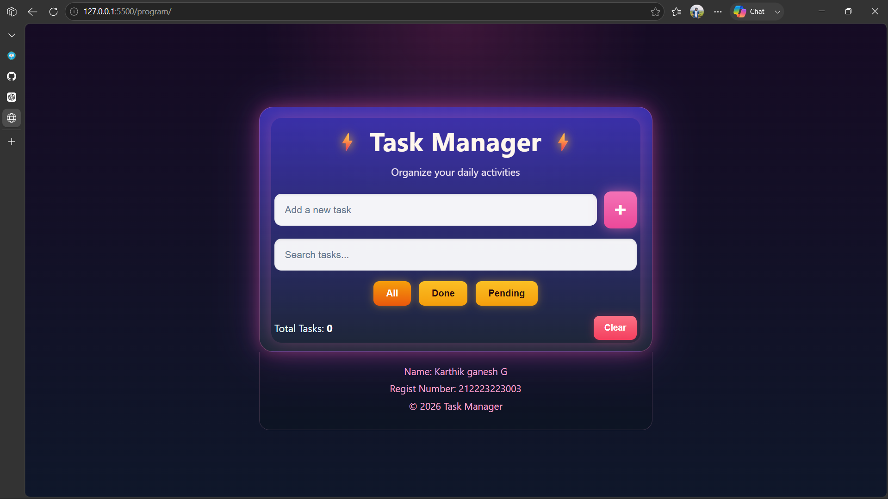

# Ex03 To-Do List using JavaScript

## AIM
To create a To-do Application with all features using JavaScript.

## ALGORITHM
### STEP 1
Build the HTML structure (index.html).

### STEP 2
Style the App (style.css).

### STEP 3
Plan the features the To-Do App should have.

### STEP 4
Create a To-do application using Javascript.

### STEP 5
Add functionalities.

### STEP 6
Test the App.

### STEP 7
Open the HTML file in a browser to check layout and functionality.

### STEP 8
Fix styling issues and refine content placement.

### STEP 9
Deploy the website.

### STEP 10
Upload to GitHub Pages for free hosting.

## PROGRAM

### HTML
```
<!DOCTYPE html>
<html lang="en">
<head>
    <meta charset="UTF-8">
    <meta name="viewport" content="width=device-width, initial-scale=1.0">
    <title>Task Manager</title>
    <link rel="stylesheet" href="style.css">
</head>
<body>
    <div class="page-shell">
        <div class="task-card">
            <div class="title-row">
                <span class="bolt">⚡</span>
                <h1>Task Manager</h1>
                <span class="bolt">⚡</span>
            </div>

            <p class="subtitle">Organize your daily activities</p>

            <div class="input-row">
                <input id="taskInput" type="text" placeholder="Add a new task" onkeypress="handleKeyPress(event)">
                <button class="add-btn" onclick="addTask()">+</button>
            </div>

            <div class="search-row">
                <input type="text" placeholder="Search tasks...">
            </div>

            <div class="filter-row">
                <button class="filter-btn active">All</button>
                <button class="filter-btn">Done</button>
                <button class="filter-btn">Pending</button>
            </div>

            <div class="task-summary">
                <span>Total Tasks: <strong id="totalTasks">0</strong></span>
                <button class="clear-btn" onclick="clearAll()">Clear</button>
            </div>
        </div>

        <footer class="page-footer">
            <p>Name: Karthik ganesh G</p>
            <p>Regist Number: 212223223003</p>
            <p>© 2026 Task Manager</p>
        </footer>
    </div>

    <script src="script.js"></script>
</body>
</html>
```

### CSS
```
* {
    margin: 0;
    padding: 0;
    box-sizing: border-box;
}

body {
    margin: 0;
    min-height: 100vh;
    display: flex;
    justify-content: center;
    align-items: center;
    background: linear-gradient(135deg, #1f0d2a 0%, #2b1146 30%, #0f172a 100%);
    font-family: "Segoe UI", Arial, sans-serif;
    color: #fdf2f8;
}

.page-shell {
    width: 100%;
    min-height: 100vh;
    display: flex;
    flex-direction: column;
    justify-content: center;
    align-items: center;
    background: radial-gradient(circle at top, rgba(236, 72, 153, 0.18), transparent 30%), linear-gradient(180deg, #160b24 0%, #0f172a 100%);
    padding: 30px 20px 0;
}

.task-card {
    width: min(92vw, 680px);
    background: linear-gradient(180deg, rgba(67, 56, 202, 0.82), rgba(31, 41, 55, 0.88));
    border: 1px solid rgba(244, 114, 182, 0.4);
    border-radius: 24px;
    padding: 28px 26px 20px;
    box-shadow: 0 0 30px rgba(236, 72, 153, 0.4), 0 0 70px rgba(168, 85, 247, 0.25);
    position: relative;
}

.task-card::before {
    content: "";
    position: absolute;
    inset: 18px 20px 15px;
    border-radius: 18px;
    box-shadow: 0 0 30px rgba(244, 114, 182, 0.35);
    pointer-events: none;
}

.title-row {
    display: flex;
    align-items: center;
    justify-content: center;
    gap: 16px;
    margin-bottom: 12px;
    position: relative;
    z-index: 1;
}

.bolt {
    font-size: 2rem;
    color: #fbbf24;
    text-shadow: 0 0 16px rgba(251, 191, 36, 0.95);
}

h1 {
    font-size: clamp(2rem, 3vw, 3rem);
    font-weight: 700;
    color: #fff7ed;
    letter-spacing: 0.5px;
}

.subtitle {
    text-align: center;
    color: #fdf2f8;
    font-size: 1.1rem;
    margin-bottom: 22px;
    opacity: 0.95;
    position: relative;
    z-index: 1;
}

.input-row,
.search-row {
    display: flex;
    align-items: center;
    gap: 12px;
    position: relative;
    z-index: 1;
}

.input-row {
    margin-bottom: 18px;
}

input {
    width: 100%;
    border: none;
    border-radius: 12px;
    background: rgba(255, 255, 255, 0.95);
    color: #1b2734;
    font-size: 1.05rem;
    padding: 18px 18px;
    outline: none;
    box-shadow: inset 0 2px 4px rgba(0,0,0,0.08);
}

input::placeholder {
    color: #64748b;
}

.add-btn {
    border: none;
    width: 64px;
    height: 64px;
    border-radius: 12px;
    background: linear-gradient(180deg, #f472b6, #ec4899);
    color: #fff;
    font-size: 2.25rem;
    font-weight: 700;
    cursor: pointer;
    box-shadow: 0 0 20px rgba(244, 114, 182, 0.6);
}

.search-row {
    margin-bottom: 18px;
}

.search-row input {
    background: rgba(255,255,255,0.94);
}

.filter-row {
    display: flex;
    justify-content: center;
    gap: 14px;
    margin-bottom: 18px;
    position: relative;
    z-index: 1;
}

.filter-btn {
    border: none;
    border-radius: 10px;
    background: linear-gradient(180deg, #fbbf24, #f59e0b);
    color: #2b110d;
    padding: 12px 22px;
    font-weight: 700;
    font-size: 1rem;
    cursor: pointer;
    box-shadow: 0 0 14px rgba(251, 191, 36, 0.4);
}

.filter-btn.active {
    background: linear-gradient(180deg, #f59e0b, #ea580c);
    color: white;
}

.task-summary {
    display: flex;
    justify-content: space-between;
    align-items: center;
    color: #ebfeff;
    font-size: 1.1rem;
    margin-top: 10px;
    position: relative;
    z-index: 1;
}

.task-summary strong {
    color: #fff;
}

.clear-btn {
    border: none;
    border-radius: 10px;
    background: linear-gradient(180deg, #fb7185, #f43f5e);
    color: #fff;
    padding: 12px 18px;
    font-weight: 700;
    font-size: 0.95rem;
    cursor: pointer;
    box-shadow: 0 0 14px rgba(244, 63, 94, 0.35);
}

.page-footer {
    width: min(92vw, 680px);
    background: linear-gradient(180deg, rgba(19, 17, 39, 0.95), rgba(12, 20, 36, 0.97));
    color: #f9a8d4;
    text-align: center;
    padding: 18px 10px 26px;
    border: 1px solid rgba(249, 168, 212, 0.2);
    border-top: none;
    border-radius: 0 0 18px 18px;
    font-size: 1.05rem;
    line-height: 1.8;
    margin-top: 0;
}

.page-footer p {
    margin: 0;
}

@media (max-width: 640px) {
    .task-card {
        padding: 22px 16px 16px;
    }

    .title-row {
        gap: 8px;
    }

    .bolt {
        font-size: 1.5rem;
    }

    .input-row {
        flex-direction: column;
    }

    .add-btn {
        width: 100%;
        height: 52px;
    }

    .filter-row {
        flex-wrap: wrap;
    }

    .task-summary {
        flex-direction: column;
        gap: 12px;
    }

    .page-footer {
        font-size: 0.95rem;
    }
}
```

### JS
```
let tasks = [];

function addTask() {

    const taskInput = document.getElementById("taskInput");

    const taskText = taskInput.value.trim();

    if (taskText === "") {

        alert("Please enter a task!");

        return;
    }

    const task = {
        id: Date.now(),
        text: taskText,
        completed: false
    };

    tasks.push(task);

    taskInput.value = "";

    displayTasks();
}


function displayTasks() {

    const taskList = document.getElementById("taskList");

    const emptyMessage = document.getElementById("emptyMessage");

    taskList.innerHTML = "";

    if (tasks.length === 0) {

        emptyMessage.style.display = "block";

    } else {

        emptyMessage.style.display = "none";

        tasks.forEach(function(task) {

            const li = document.createElement("li");

            li.className = "task";

            const span = document.createElement("span");

            span.className = "task-text";

            span.textContent = task.text;

            if (task.completed) {

                span.classList.add("completed");

            }

            span.onclick = function() {

                toggleTask(task.id);

            };


            const deleteButton = document.createElement("button");

            deleteButton.textContent = "Delete";

            deleteButton.className = "delete-btn";

            deleteButton.onclick = function() {

                deleteTask(task.id);

            };


            li.appendChild(span);

            li.appendChild(deleteButton);

            taskList.appendChild(li);

        });
    }

    updateTaskCount();
}


function toggleTask(id) {

    tasks = tasks.map(function(task) {

        if (task.id === id) {

            task.completed = !task.completed;

        }

        return task;

    });

    displayTasks();
}


function deleteTask(id) {

    tasks = tasks.filter(function(task) {

        return task.id !== id;

    });

    displayTasks();
}


function clearCompleted() {

    tasks = tasks.filter(function(task) {

        return !task.completed;

    });

    displayTasks();
}


function clearAll() {

    if (tasks.length === 0) {

        return;

    }

    const confirmation = confirm(
        "Are you sure you want to delete all tasks?"
    );

    if (confirmation) {

        tasks = [];

        displayTasks();

    }
}


function updateTaskCount() {

    const total = tasks.length;

    const completed = tasks.filter(function(task) {

        return task.completed;

    }).length;

    const pending = total - completed;

    document.getElementById("totalTasks").textContent = total;

    document.getElementById("completedTasks").textContent = completed;

    document.getElementById("pendingTasks").textContent = pending;
}


function handleKeyPress(event) {

    if (event.key === "Enter") {

        addTask();

    }
}


displayTasks();
```


## OUTPUT


## RESULT
The program for creating To-do list using JavaScript is executed successfully.